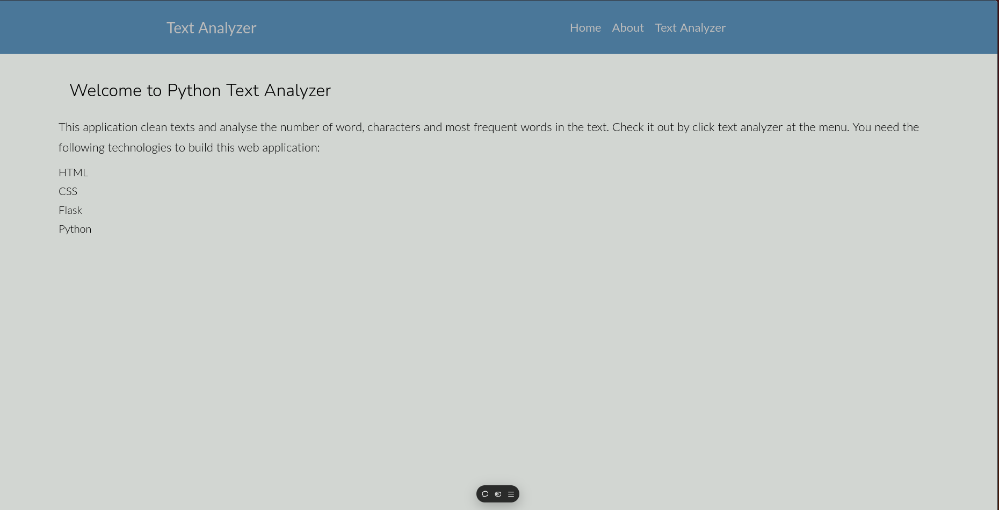
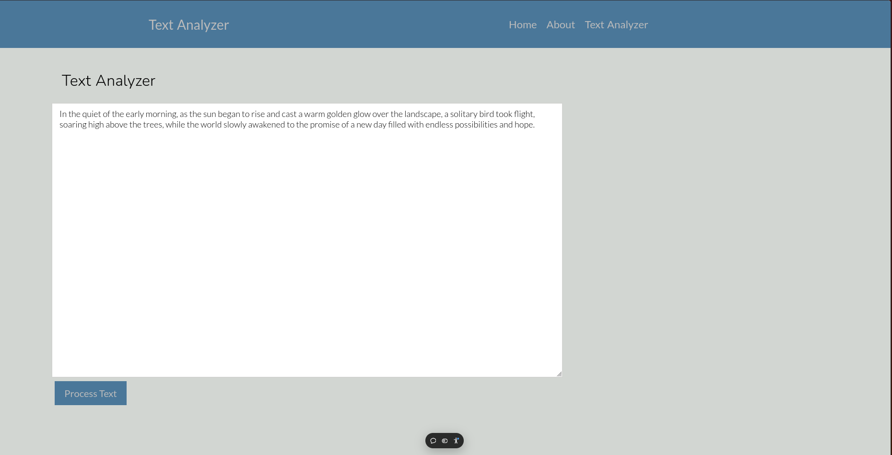
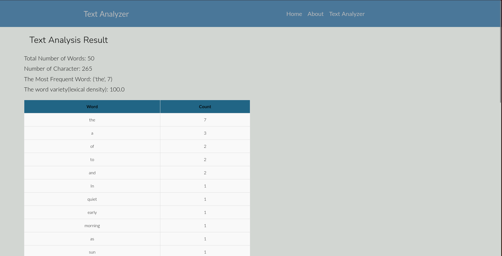

# :mag_right: Python Text Analyzer

A simple web based text analysis tool built with Python and Flask. This project is inspired by the "30 Days of Python" course by Asabeneh Yetayeh.

## Table of Contents

- [Features](#features)
- [Installation](#installation)
- [Usage](#usage)
- [Preview](#preview)

## Features

- Total Number of Words
- Number of Characters
- The Most Frequent Words
- The Word Variety (Lexical Density)

## Installation

To run this project, you need Python 3.x installed on your machine. You can install the necessary dependencies using pip:

```bash
pip install -r requirements.txt
```

## Usage
1. Clone this repository: 
	```bash
	git clone https://github.com/fajarhadid/python_text_analyzer.git
	```
2.  Set up a virtual environment
3. Install dependencies (requirement.txt)
4. Run the flask application
	```bash
	flask run
	```

## Preview
Here are some preview of the python web text analyzer:
You can access the web from this link [Python Text Analyzer Link](https://python-text-analyzer.vercel.app/)
- Home


- Text Analyzer Input


- Result
